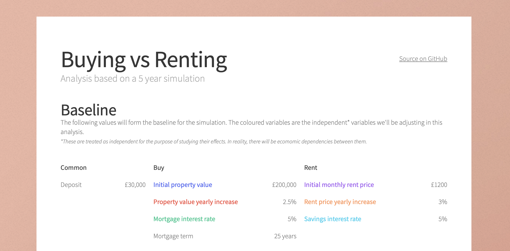

# Mortgage Simulator

A deterministic simulator written in C# can be found in `Simulator/` which compares two options that prospective first time buyers are faced with:
* Buying a property with a mortgage
* Renting a property and investing any remaining funds.

The results of this simulation are presented on a web page in `docs/` and hosted at [craigwalton.github.io/MortgageSim](https://craigwalton.github.io/MortgageSim).

The Jupyter notebooks in `Analysis/` are used to generate the Plotly plots used on the web page.

The numeric results of the simulation are written to the `Data/` directory as CSV files.

## Limitations and non-goals

This simulator takes no consideration of the affordability of either scenario. Either scenario may result
in negative equity.

Costs associated with property purchase (e.g. stamp duty, solicitor fees, mortgage product fees, maintenance fees or
mortgage early repayment fees) are not considered.

This simulator only considers the financial ramifications of the two options. It does not consider non-monetary aspects
such as the speed of property transactions, the flexibility to make home modifications, or other lifestyle factors.

## Data Sources

The following sources were consulted in November 2023 to select appropriate baseline values for the independent variables.

* [Historical House Prices: ONS](https://www.ons.gov.uk/economy/inflationandpriceindices/bulletins/housepriceindex/august2023)
* [Historical Mortgage Inerest Rates: Statisca](https://www.statista.com/statistics/386301/uk-average-mortgage-interest-rates/)
* [Historical Rent Prices: ONS](https://www.ons.gov.uk/economy/inflationandpriceindices/bulletins/indexofprivatehousingrentalprices/september2023)
* [Historical Bank Rate: BoE](https://www.bankofengland.co.uk/boeapps/database/Bank-Rate.asp)
